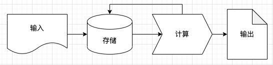
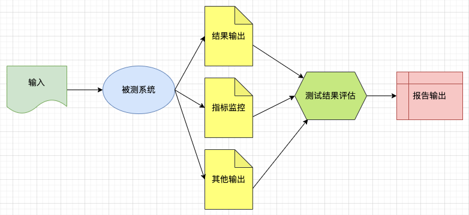

# 大数据平台系统测试总结
## 系统测试的基础理解
### 软件系统模型抽象
所有的软件系统都可以抽象成如下的处理流程
软件系统的**四元组**：输入、存储、计算、输出

* 批处理系统
* 流式计算系统
  

### 测试模型抽象

所有的软件测试过程，都可以抽象成一下流程
* 单元测试
* 集成测试
* 系统测试
* 性能、稳定性、混沌测试

## 大数据系统测试的整体分析
为了进行更大数据量的计算，通过分布式的存储框架，和分布式的计算框架，产生了大数据处理系统。
类比于传统的操作系统，**分布式存储**系统解决文件、数据的存储问题，**分布式计算**完成计算逻辑，类似于操作系统的调度模块，要增加一个**调度系统**，管理资源及任务。
**流式计算**系统也是一种分布式计算系统，类似于操作系统一直运行，等待着程序一个一个进行执行。

以下的一些表述及出发点，主要是基于一个大数据平台系统的测试，保证平台稳定的运行各种大数据业务。

### 系统特点
1. 测试数量大
2. 任务运行时间长
3. 具备容错恢复系统
4. 整个系统的稳定性要求更高，恢复成本高

### 测试难点
1. 测试环境模拟真实环境
2. 大数量结果对比
3. 多系统集成的稳定性风险
4. 多系统难以全面系统的熟悉

### 系统测试自动化分析
实现自动化的必要条件：
1. 单元测试的覆盖及借鉴
2. 系统客户端、API的封装
3. 数据构造工具
4. 数据比对工具
5. 各系统通用场景的设计与构造
6. 特定系统的周边组件mock与压测

## 大数据系统测试的具体分析
如下分类是基于当前业界流行的大数据系统进行粗略划分，有些系统可能兼具多个系统的功能。
所有的软件系统的产生的原始驱动力都是业务需求。而随着业务的扩展，系统的不断进化与迭代，又会不断产生新出需求。
无论如何变化与创新，都离不开**四元组**，只是不断的改进优化他们，使软件更快，更强大。

### 通用文件存储系统
#### 功能概述
#### 系统举例
hdfs、allxio、Ozone、Ceph
#### 系统架构差异分析
#### 自动化测试方法

### 结构化数据存储系统
#### 功能概述
#### 系统举例
HBase、PS（KV）、Postgresql
#### 系统架构差异分析
#### 自动化测试方法

### 资源调度系统
#### 功能概述
#### 系统举例
Yarn、US（统一调度）、K8s
#### 系统架构差异分析
#### 自动化测试方法

### 流式计算系统
#### 功能概述
#### 系统举例
Kfaka、pulsar、flink、flume、storm、 Bus、Tube、Hippo
#### 系统架构差异分析
#### 自动化测试方法

### SQL引擎系统
#### 功能概述
#### 系统举例
Hive、Spark、Presto、Cylin、Qurid、ClickHouse
#### 系统架构差异分析
#### 测试难点
- SQL覆盖度
- 特定SQL的优化效果
- 数据类型多样性
- 大数据量结果一致性对比
- 计算高效性
#### 自动化测试方法
1. 现网SQL的引入
2. 特殊SQL的积累
3. 查询计划的分析与数据构造
4. 数据染色与结果抽样、统计分析
5. 相同环境下的不同版本耗时对比

### 语言引擎系统
#### 功能概述
#### 系统举例
PySpark、SparkScala、Pig、Taz、MapReduce
#### 系统架构差异分析
#### 自动化测试方法

## 通用自动化测试框架设计
### 被测环境抽象
### 自动化运行系统
- 测试场景、监控指标的自动配置
- 多种自动化框架的封装
- 性能稳定性场景的抽象
### 被测环境的自动化部署
### 大数据组件客户端的封装
