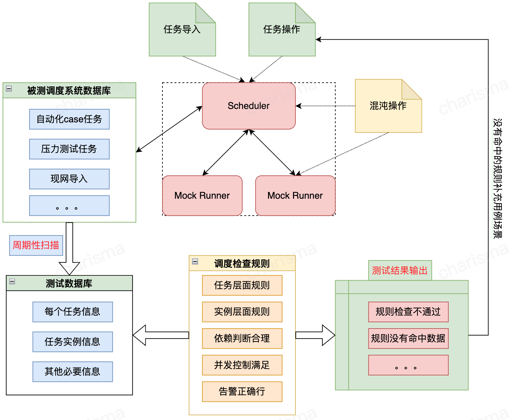

##### 调度系统后台通用测试框架
Case By Case 的测试，只能关注到当前case，当前时间到调度效果。而对于调度系统来说，他会在后台持续到产生新的运行实例，对他们进行下发、运行、重试、告警等。
由于某些情况、某些时间后台的Bug引起的问题，CBC难以覆盖，需要一种类似轮训check的方式，去cover整个调度全景。
可以通过对调度过程的**周期性的扫描保存**，半离线**基于规则**分析任务状态的变更、依赖满足、并发限制等是否满足调度需求来发现“背后”的问题。

1. 整体测试框架
   
2. 具体的规则分类（举例）
   * 任务规则
     1. 任务状态：Running任务最近周期是否有实例化，
     2. 到期、冻结、停止任务不能进行实例化
     3. 任务实例化出来的实例数据时间、执行时间是否符合预期
   * 实例规则
     1. 实例的状态变更是否符合状态机变更规律
     2. 失败的实例是否进行了重试
   * 依赖规则
     1. 没有下发的实例是否符合依赖判断
     2. running的实例是否符合依赖判断
     3. running的起始时间是否符合依赖判断
   * 并发控制
     1. 实例运行是否符合并发、顺序调度
     2. 实例运行并发是否符合任务类型并发度
     3. 实例运行并发是否符合loader设置度并发
     4. 实例运行数量是否符合并发分组的控制
   * 告警规则
     1. 重试失败的任务是否有告警
     2. 超时的任务是否有告警
     3. 所有系统产生的告警是否合理
3. 压力与数据量控制
   * 控制采集的任务量，不进行全部采集
   * 通过状态进行实例选择，放弃运行完成的实例
   * 控制扫描时间间隔（2-5分钟）
4. 运行时间的判断
   * 通过规则命中率判断
   * 通过小时、天任务的实例化次数判断
   * 根据具体现实情况判断
5. Runner返回的控制
   * 全部返回成功
   * 随机返回成功
   * 指定返回失败
6. 同步的手工与自动化补足
   * 对于没有命中的规则，去发确定是否满足，需要增加测试用例覆盖
   * 此框架的执行，仍然欠缺如下场景，需要自动化或手工测试覆盖：
     1. 任务的创建、更新
     2. 任务类型的覆盖，任务类型的特定运行逻辑
     3. 任务的导入导出
     4. API操作和UI操作
